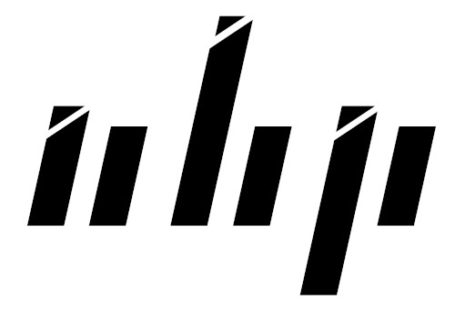

# :computer: My Setup 
    

# :keyboard: Programming Languages
           
 

# :desktop_computer:  Framework, Libraries, and Other Technologies
          
                 

# :pager: Social Media

